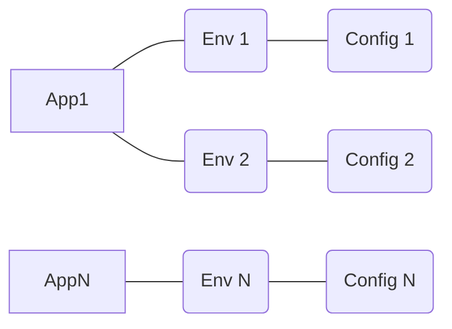

# Configmonkey

A lightweight configuration service that supports managing app configurations across multiple environments. Configmonkey was build with distributed environments in mind and it's goal is to provide an easy way to externalize and manage microservice configurations from a single place, without interfering with the application's ci/cd lifecycle.

## Features

- Multiple configs per environment
- Multiple environments per app
- Human readable URIs
- HTTP/JSON API
- Containerized deployment

## How To Run

### App on host with dependencies on docker

Recommended for local development

```
# Start Dependencies
docker compose --profile deps-only up

# Start Configmonkey
cargo run
```

### Full docker setup

Recommended for deployments/general usage

```
docker compose --profile full up
```

## Architecture



The root domain for configs is the Application (`Apps`). Each App contains multiple Environments (`Envs`), which contain exactly 1 Configuration (`Config`)

## API Reference

## Contributors

[](https://github.com/madoke/configmonkey/graphs/contributors) [](https://github.com/madoke/configmonkey/graphs/contributors)

Configmonkey is a recent project and welcomes new contributors. The preferred ways to help out are:

- Opening an issue reporting a problem or feature creep;
- Submit a pull request to fix an open issue;
- Submit a pull request to fix a bug that doesn't have an open issue;

Detailed information about how to contribute can be found in the [contribution guide](CONTRIBUTING.md)
